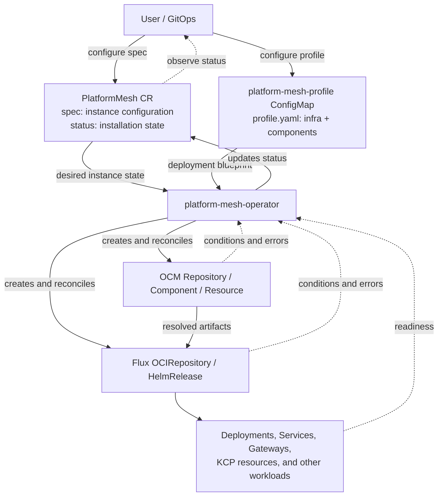

# Platform Mesh installation

This directory documents the declarative Helm installation of Platform Mesh.
The same charts support production clusters and local Kind clusters; only the
commands and target-specific Helm values differ. There are no bootstrap
scripts.

GitHub-flavored Markdown does not support tabs. The command alternatives below
use collapsible sections instead. Choose either **Production** or **Kind** and
use that same target throughout the procedure.

The installation has two layers:

- `platform-mesh-prerequisites` installs, or can be replaced by, the cluster
  infrastructure that Platform Mesh consumes: Flux, the OCM controller,
  cert-manager, Gateway API CRDs, Traefik, Traefik CRDs, CloudNativePG, and the
  Keycloak, KCP, and etcd-druid operators.
- `platform-mesh-operator` installs PMO and a `PlatformMesh` resource. PMO then
  reconciles the Platform Mesh component and its services.

## How the installation works

The complete Platform Mesh installation is orchestrated by the
`platform-mesh-operator`. The prerequisites chart only supplies the controllers
and CRDs that PMO needs; it does not install the Platform Mesh services.

PMO has two user-configurable inputs:

1. The **`PlatformMesh` custom resource** defines instance-specific settings,
   such as exposure, OCM configuration, feature toggles, and per-instance
   overrides.
2. The **`platform-mesh-profile` ConfigMap** contains `profile.yaml`, the broad
   deployment blueprint. Its `infra` and `components` sections define which
   services are enabled, their deployment settings, dependencies, and base Helm
   values.

The operator merges these inputs, renders its deployment templates, and
continuously reconciles the result. In this installation, the operator Helm
chart creates the initial `PlatformMesh` resource and profile ConfigMap. Keep
their desired configuration in Helm values or in the GitOps source that owns
these two objects.



> [!IMPORTANT]
> Configure Platform Mesh only through the `PlatformMesh` resource and the
> `platform-mesh-profile` ConfigMap. PMO owns generated resources such as OCM
> `Resource` objects, Flux `OCIRepository` and `HelmRelease` objects,
> `Deployment` objects, and their supporting resources. They may be inspected
> for diagnostics, but must not be configured or modified directly. PMO can
> overwrite such changes, and direct edits can leave the installation
> inconsistent with its declared inputs.

The `PlatformMesh` resource's `status` is the source of truth for installation
progress. PMO reports the current reconciliation stage and any errors there,
including transient or expected errors while dependencies are still becoming
ready. A successful installation eventually reports `Ready=True`; when it is
not ready, inspect its conditions and messages before looking at generated
resources:

```shell
kubectl --namespace platform-mesh-system \
  get platformmesh platform-mesh \
  --output yaml
```

If an error persists, correct the `PlatformMesh` spec, the profile ConfigMap, or
the external prerequisite identified by the status. Do not work around it by
patching an operator-generated resource. For the complete input schema and
merge behavior, see the
[platform-mesh-operator documentation](https://github.com/platform-mesh/platform-mesh/blob/main/operators/platform-mesh-operator/README.md).

## Requirements

- Helm and `kubectl`, configured for the target cluster.
- A Platform Mesh OCM component version available from the configured registry.
- A Traefik Gateway implementation with a `GatewayClass` named `traefik`. The
  bundled prerequisites chart provides both by default.
- For Kind, at least 8 vCPUs are recommended for the complete workload.

## 1. Prepare the cluster

Start with an existing production cluster or create a local Kind cluster. The
Kind configuration maps `127.0.0.1:8443` to Traefik's NodePort `31000`.

<details open>
<summary><strong>Production</strong></summary>

Confirm that `kubectl` targets the intended cluster:

```shell
kubectl config current-context
```

</details>

<details>
<summary><strong>Kind</strong></summary>

```shell
kind create cluster --name platform-mesh --image kindest/node:v1.35.1 --config=- <<'EOF'
apiVersion: kind.x-k8s.io/v1alpha4
kind: Cluster
networking:
  apiServerAddress: "127.0.0.1"
  kubeProxyMode: iptables
nodes:
  - role: control-plane
    extraPortMappings:
      - containerPort: 31000
        hostPort: 8443
        protocol: TCP
        listenAddress: "127.0.0.1"
EOF
```

</details>

## 2. Install the prerequisites

Skip this step only when the cluster already provides compatible Flux, OCM
controller, cert-manager, Gateway API and Traefik CRDs, a Traefik
`GatewayClass`, CloudNativePG, and the Keycloak, KCP, and etcd-druid operators.

The bundled chart is installed in two passes. The first pass establishes the
controllers and CRDs; the second pass enables Traefik after the Gateway API
kinds are discoverable.

<details open>
<summary><strong>Production</strong></summary>

```shell
helm upgrade --install platform-mesh-prerequisites \
  ./charts/platform-mesh-prerequisites \
  --namespace platform-mesh-system \
  --create-namespace \
  --wait \
  --timeout 15m

helm upgrade platform-mesh-prerequisites \
  ./charts/platform-mesh-prerequisites \
  --namespace platform-mesh-system \
  --reset-values \
  --wait \
  --timeout 15m \
  --set traefik.enabled=true \
  --set traefik.service.type=LoadBalancer \
  --set traefik.service.spec.type=LoadBalancer \
  --set traefik.ports.websecure.exposedPort=443

until load_balancer_address=$(kubectl --namespace platform-mesh-system \
  get service platform-mesh-prerequisites-traefik \
  --output jsonpath='{.status.loadBalancer.ingress[0].ip}{.status.loadBalancer.ingress[0].hostname}') \
  && [ -n "${load_balancer_address}" ]; do
  echo "Waiting for LoadBalancer address..."
  sleep 5
done

echo "LoadBalancer address: ${load_balancer_address}"
```

</details>

<details>
<summary><strong>Kind</strong></summary>

```shell
helm upgrade --install platform-mesh-prerequisites \
  ./charts/platform-mesh-prerequisites \
  --namespace platform-mesh-system \
  --set keycloak-operator.watchNamespaces=platform-mesh-system \
  --create-namespace \
  --wait \
  --timeout 15m

helm upgrade platform-mesh-prerequisites \
  ./charts/platform-mesh-prerequisites \
  --namespace platform-mesh-system \
  --reset-values \
  --wait \
  --timeout 15m \
  --set traefik.enabled=true \
  --set traefik.service.type=NodePort \
  --set traefik.service.spec.type=NodePort \
  --set traefik.service.spec.clusterIP=10.96.188.4 \
  --set traefik.ports.websecure.exposedPort=8443 \
  --set traefik.ports.websecure.nodePort=31000

traefik_cluster_ip=$(kubectl --namespace platform-mesh-system \
  get service platform-mesh-prerequisites-traefik \
  --output jsonpath='{.spec.clusterIP}')

echo "Traefik ClusterIP: ${traefik_cluster_ip}"
```

</details>

## 3. Configure the domain, certificates, and install Platform Mesh

Set the base domain and desired OCM component version before installing PMO.
The base domain and its wildcard subdomains must resolve to Traefik. Production
DNS must point to the LoadBalancer address; the `.localhost` domain used by Kind
resolves to the local machine.

Choose who manages the domain certificates with
`installation.selfSignedCertificate.enabled`:

- `true` asks cert-manager to create a private self-signed CA and issue the
  domain certificate. The operator chart creates both `domain-certificate` and
  `domain-certificate-ca`. Clients must trust the generated CA.
- `false` disables certificate generation. Before installing PMO, provision both
  Secrets yourself in `platform-mesh-system`. Use this mode for certificates
  issued by an organisation-managed or publicly trusted CA.

Externally managed Secrets must provide the following data:

| Secret | Required data |
|---|---|
| `domain-certificate` | `tls.crt`: server certificate or full chain covering the base domain and wildcard subdomains; `tls.key`: matching private key; `ca.crt`: issuing CA or trust chain |
| `domain-certificate-ca` | `tls.crt`: issuing or root CA certificate used as a trust anchor |

The CA private key is not required in `domain-certificate-ca`. For example,
create or update externally managed Secrets with:

```shell
kubectl --namespace platform-mesh-system create secret generic domain-certificate \
  --type=kubernetes.io/tls \
  --from-file=tls.crt=/path/to/tls.crt \
  --from-file=tls.key=/path/to/tls.key \
  --from-file=ca.crt=/path/to/ca.crt \
  --dry-run=client \
  --output yaml | kubectl apply --filename -

kubectl --namespace platform-mesh-system create secret generic domain-certificate-ca \
  --from-file=tls.crt=/path/to/ca.crt \
  --dry-run=client \
  --output yaml | kubectl apply --filename -
```

Set `self_signed_certificates=false` in the selected installation command when
using these externally managed Secrets.

<details open>
<summary><strong>Production</strong></summary>

```shell
base_domain=platform.example.com
platform_mesh_version=0.6.0-build.6
self_signed_certificates=true
test -n "${base_domain:-}"
test -n "${platform_mesh_version:-}"
echo "Configure ${base_domain} and *.${base_domain} for ${load_balancer_address}"

helm upgrade --install platform-mesh-operator \
  ./charts/platform-mesh-operator \
  --namespace platform-mesh-system \
  --set installation.enabled=true \
  --set installation.profile=production \
  --set installation.baseDomain="${base_domain}" \
  --set installation.port=443 \
  --set installation.kcpFrontProxyPort=443 \
  --set installation.selfSignedCertificate.enabled="${self_signed_certificates}" \
  --set-string installation.version="${platform_mesh_version}" \
  --wait \
  --timeout 15m
```

</details>

<details>
<summary><strong>Kind</strong></summary>

```shell
base_domain=portal.localhost
platform_mesh_version=0.6.0-build.6
self_signed_certificates=true
test -n "${base_domain:-}"
test -n "${platform_mesh_version:-}"

helm upgrade --install platform-mesh-operator \
  ./charts/platform-mesh-operator \
  --namespace platform-mesh-system \
  --set installation.enabled=true \
  --set installation.profile=kind \
  --set installation.baseDomain="${base_domain}" \
  --set installation.port=8443 \
  --set installation.kcpFrontProxyPort=8443 \
  --set installation.traefikClusterIP="${traefik_cluster_ip}" \
  --set installation.selfSignedCertificate.enabled="${self_signed_certificates}" \
  --set-string installation.version="${platform_mesh_version}" \
  --wait \
  --timeout 15m
```

</details>

## 4. Wait for Platform Mesh

When chart-managed certificates are enabled, wait for the generated certificate.
Then wait for the `PlatformMesh` resource to become ready:

```shell
kubectl wait --namespace platform-mesh-system \
  --for=condition=Ready platformmeshes/platform-mesh \
  --timeout=30m
```

Open the endpoint for the selected `https://${base_domain}:8443`.
