# Remote Setup — Two-Cluster ArgoCD

This document describes the remote local setup (`--remote --deployment-tech=argocd`), which runs two separate kind clusters: an **infra cluster** that hosts the platform-mesh-operator and ArgoCD, and a **runtime cluster** where all platform-mesh services are deployed.

## Overview

```mermaid
%%{init: {'theme': 'base', 'themeVariables': {'clusterBkg': '#e8e8e8', 'clusterBorder': '#000000', 'fontFamily': 'Consolas, monospace', 'fontSize': '16px'}}}%%
flowchart TB
    subgraph INFRA["⬡  INFRA CLUSTER  ·  kind: platform-mesh-infra"]
        direction TB

        subgraph NS_ARGOCD["── namespace: argocd ──"]
            ARGOCD["ArgoCD\nHelm chart v9.2.4"]
            APP_CERT["cert-manager"]
            APP_GW["gateway-api"]
            APP_TRAEFIK_CRDS["traefik-crds"]
            APP_TRAEFIK["traefik"]
            APP_SERVICES["• account-operator\n• kcp-operator\n• infra\n• security-operator\n• portal\n• openfga\n• keycloak\n• init-agent\n• iam-service\n• extension-manager-operator\n• kubernetes-graphql-gateway\n• rebac-authz-webhook\n• virtual-workspaces"]
            APP_HTTPBIN["example-httpbin-provider"]
            APP_SYNCAGENT["api-syncagent"]
            APPPROJECT["platform-mesh-runtime"]
            CLUSTER_SECRET["platform-mesh-cluster-secret\nserver: RUNTIME_CLUSTER_IP:6443"]
        end

        subgraph NS_PMO["── namespace: platform-mesh-system ──"]
            PMO["platform-mesh-operator"]
            PMO_SECRET["platform-mesh-kubeconfig\n(runtime kubeconfig)"]
            PMO_RBAC["platform-mesh-operator-deployment\nmanages: Applications · AppProjects\nHelmReleases · Secrets"]
        end

        subgraph NS_OCM_INFRA["── namespace: default ──"]
            OCM_REPO_INFRA["platform-mesh\nghcr.io/platform-mesh"]
            OCM_REPO_GARDENER["gardener-releases\neurope-docker.pkg.dev/gardener-project"]
            OCM_COMPONENT_INFRA["platform-mesh\ngithub.com/platform-mesh/platform-mesh"]
        end
    end

    subgraph RUNTIME["⬡  RUNTIME CLUSTER  ·  kind: platform-mesh"]
        direction TB

        subgraph NS_PM["── namespace: platform-mesh-system ──"]
            PM_CR["platform-mesh\ncore.platform-mesh.io/v1alpha1"]
            PROFILE_CM["platform-mesh-profile\ndeploymentTechnology: argocd\ndestinationServer: RUNTIME_CLUSTER_IP:6443"]
            PORT_FIXER["port-fixer\nsocat: node:8443 → node:31000"]
        end

        subgraph NS_OCM_RT["── namespace: platform-mesh-system (OCM) ──"]
            OCM_REPO_RT["platform-mesh\nghcr.io/platform-mesh"]
            OCM_COMPONENT_RT["platform-mesh\ngithub.com/platform-mesh/platform-mesh"]
        end

        subgraph DEPLOYED["── Deployed by ArgoCD ──"]
            SVCS["• infra\n• kcp-operator\n• account-operator\n• security-operator\n• portal\n• openfga\n• keycloak\n• init-agent\n• iam-service\n• extension-manager-operator\n• rebac-authz-webhook\n• kubernetes-graphql-gateway\n• virtual-workspaces\n• example-httpbin-provider\n• api-syncagent"]
        end
    end

    %% Force vertical stacking with gap: INFRA on top, RUNTIME below
    INFRA ~~~ SPACER1:::invisible
    SPACER1 ~~~ SPACER2:::invisible
    SPACER2 ~~~ RUNTIME

    classDef invisible display:none

    %% Operator manages ArgoCD resources on infra
    PMO -- "renders & SSA" --> APP_CERT
    PMO -- "renders & SSA" --> APP_GW
    PMO -- "renders & SSA" --> APP_TRAEFIK_CRDS
    PMO -- "renders & SSA" --> APP_TRAEFIK
    PMO -- "renders & SSA" --> APP_SERVICES
    PMO -- "creates" --> APPPROJECT
    PMO -- "mounts" --> PMO_SECRET
    PMO -- "reads profile" --> PROFILE_CM

    %% ArgoCD uses cluster secret to reach runtime
    ARGOCD -- "uses" --> CLUSTER_SECRET
    CLUSTER_SECRET -- "targets API server" --> RUNTIME

    %% Apps deploy to runtime
    APP_CERT --> DEPLOYED
    APP_GW --> DEPLOYED
    APP_TRAEFIK --> DEPLOYED
    APP_SERVICES --> DEPLOYED
    APP_HTTPBIN --> DEPLOYED
    APP_SYNCAGENT --> DEPLOYED

    PM_CR -- "profileConfigMap" --> PROFILE_CM
    OCM_COMPONENT_INFRA -- "version source" --> PMO
    OCM_COMPONENT_RT -- "version source" --> PM_CR

    %% ── Subgraph background shading ────────────────────────────────
    %% Cluster level → light grey
    style INFRA fill:#e8e8e8,stroke:#000,stroke-width:3px,color:#111
    style RUNTIME fill:#e8e8e8,stroke:#000,stroke-width:3px,color:#111
    %% Namespace level → 20% darker
    style NS_ARGOCD fill:#c8c8c8,stroke:#000,stroke-width:2px,color:#111
    style NS_PMO fill:#c8c8c8,stroke:#000,stroke-width:2px,color:#111
    style NS_OCM_INFRA fill:#c8c8c8,stroke:#000,stroke-width:2px,color:#111
    style NS_PM fill:#c8c8c8,stroke:#000,stroke-width:2px,color:#111
    style NS_OCM_RT fill:#c8c8c8,stroke:#000,stroke-width:2px,color:#111
    style DEPLOYED fill:#c8c8c8,stroke:#000,stroke-width:2px,color:#111

    %% ── Color classes ──────────────────────────────────────────────
    %% ArgoCD Application  →  orange
    classDef argoApp    fill:#f4a460,stroke:#c8762a,color:#1a0a00
    %% ArgoCD AppProject   →  dark orange
    classDef argoProj   fill:#e07b20,stroke:#a05010,color:#fff
    %% ArgoCD server       →  deep orange
    classDef argoServer fill:#d45f00,stroke:#8b3a00,color:#fff
    %% Secret              →  red
    classDef secret     fill:#e05555,stroke:#a02020,color:#fff
    %% Deployment          →  blue
    classDef deployment fill:#4a90d9,stroke:#2060a0,color:#fff
    %% ClusterRole/RBAC    →  purple
    classDef rbac       fill:#9b59b6,stroke:#6c3483,color:#fff
    %% ConfigMap           →  teal
    classDef configmap  fill:#2eb8b8,stroke:#1a8080,color:#fff
    %% Custom Resource     →  green
    classDef cr         fill:#27ae60,stroke:#1a7a40,color:#fff
    %% DaemonSet           →  dark blue
    classDef daemonset  fill:#2c5f8a,stroke:#1a3d5c,color:#fff
    %% OCM resources       →  grey-blue
    classDef ocm        fill:#7f8c8d,stroke:#4d6060,color:#fff
    %% Deployed services   →  light green
    classDef service    fill:#a8d8a8,stroke:#5a9a5a,color:#1a1a1a

    class APP_CERT,APP_GW,APP_TRAEFIK_CRDS,APP_TRAEFIK,APP_SERVICES,APP_HTTPBIN,APP_SYNCAGENT argoApp
    class APPPROJECT argoProj
    class ARGOCD argoServer
    class CLUSTER_SECRET,PMO_SECRET secret
    class PMO deployment
    class PMO_RBAC rbac
    class PROFILE_CM configmap
    class PM_CR cr
    class PORT_FIXER daemonset
    class OCM_REPO_INFRA,OCM_REPO_GARDENER,OCM_COMPONENT_INFRA,OCM_REPO_RT,OCM_COMPONENT_RT ocm
    class SVCS service
```



### Color Legend

| Color | Resource Kind |
|-------|--------------|
| 🟠 Orange | ArgoCD `Application` |
| 🟤 Dark orange | ArgoCD `AppProject` |
| 🔴 Deep orange | ArgoCD server (Helm release) |
| 🔴 Red | `Secret` |
| 🔵 Blue | `Deployment` (operator) |
| 🟣 Purple | `ClusterRole` / RBAC |
| 🩵 Teal | `ConfigMap` |
| 🟢 Green | Custom Resource (`PlatformMesh`) |
| 🔷 Dark blue | `DaemonSet` |
| ⬜ Grey-blue | OCM `Repository` / `Component` |
| 🌿 Light green | Deployed services (managed by ArgoCD) |

## Cluster Roles

| Cluster | Name | Purpose |
|---------|------|---------|
| Infra | `kind-platform-mesh-infra` | Hosts ArgoCD and the platform-mesh-operator. Manages deployments to the runtime cluster. |
| Runtime | `kind-platform-mesh` | Hosts all platform-mesh services. Targeted by ArgoCD via cluster secret. |

## Key Resources

### Infra Cluster

#### ArgoCD (`namespace: argocd`)

| Resource | Type | Description |
|----------|------|-------------|
| `platform-mesh-cluster-secret` | Secret | Registers the runtime cluster in ArgoCD using `RUNTIME_CLUSTER_IP` and TLS credentials extracted from the runtime kubeconfig |
| `platform-mesh-runtime` | AppProject | Scopes all platform-mesh ArgoCD Applications to the runtime cluster destination |
| `cert-manager` | Application | Installs cert-manager on the runtime cluster |
| `gateway-api` | Application | Installs Gateway API CRDs on the runtime cluster |
| `traefik-crds` | Application | Installs Traefik CRDs on the runtime cluster |
| `traefik` | Application | Installs Traefik (NodePort, exposes 8443) on the runtime cluster |
| `<service-name>` | Application (per service) | One Application per enabled component in the profile — deploys platform-mesh services via Helm/OCM to the runtime cluster |
| `api-syncagent` | Application | Deploys the KCP api-syncagent chart to sync `orchestrate.platform-mesh.io` API types from KCP into the runtime cluster |
| `example-httpbin-provider` | Application | Deploys the example httpbin operator as a demo provider registered via KCP |

#### platform-mesh-operator (`namespace: platform-mesh-system`)

| Resource | Type | Description |
|----------|------|-------------|
| `platform-mesh-operator` | Deployment | The operator itself — runs on infra, reconciles `PlatformMesh` CRs on runtime, renders Go templates and applies ArgoCD Applications via SSA |
| `platform-mesh-kubeconfig` | Secret | The runtime cluster kubeconfig, mounted into the operator pod at `/etc/platformmesh/kubeconfig` |
| `platform-mesh-operator-deployment` | ClusterRole | Grants the operator permission to manage ArgoCD `Application`/`AppProject`, FluxCD `HelmRelease`/`Kustomization`, and Secrets |

### Runtime Cluster

| Resource | Type | Description |
|----------|------|-------------|
| `platform-mesh` | PlatformMesh CR | The main custom resource reconciled by the operator. References the profile ConfigMap, sets exposure (port 8443, `portal.localhost`), OCM config, feature toggles, and per-service value overrides |
| `platform-mesh-profile` | ConfigMap | Contains `profile.yaml` with two sections: `infra` (cert-manager, traefik, gateway-api, etcd-druid config) and `components` (all service configs). `destinationServer` is set to `https://${RUNTIME_CLUSTER_IP}:6443` at apply time |
| `port-fixer` | DaemonSet | Runs `socat` on each node to forward `node:8443 → node:31000`, fixing port accessibility issues on macOS/Podman where Traefik's NodePort (31000) is not directly reachable on port 8443 |
| `platform-mesh` | OCM Component | Tracks the platform-mesh OCM component version from `ghcr.io/platform-mesh` |

## How `RUNTIME_CLUSTER_IP` Works

The runtime cluster's IP is the internal Docker/Podman network address of the `platform-mesh-control-plane` container. It is resolved at setup time and substituted via `envsubst` into:

1. **`platform-mesh-cluster-secret`** — ArgoCD uses this IP to reach the runtime cluster's API server
2. **`platform-mesh-profile` ConfigMap** — `destinationServer: https://${RUNTIME_CLUSTER_IP}:6443` tells ArgoCD where to deploy
3. **Operator pod `hostAliases`** — allows the operator to resolve `portal.localhost` and `localhost` to the runtime cluster IP

## Starting the Remote Setup

```bash
./local-setup/scripts/start.sh --remote --deployment-tech=argocd
```

Optional flags:
- `--example-data` — applies the `default-profile.yaml` ConfigMap and example httpbin provider
- `--cached` — reuses existing kind cluster images
- `--concurrent` — parallel OCM component downloads
